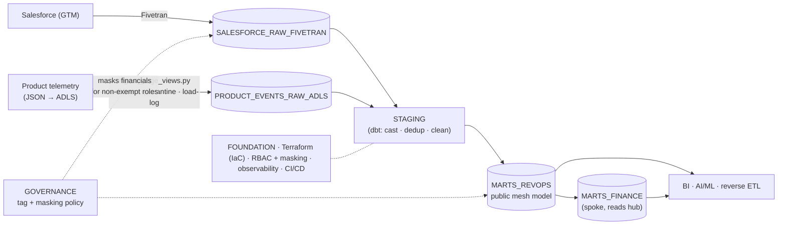

# OpenGov Data Platform — Sr Data Platform Engineer Case Study

A working, config-driven data platform on Snowflake — RBAC, PII governance,
telemetry ingestion, native dbt, and CI/CD — built for the OpenGov *Senior Data
Platform Engineer* case study. Everything is **code**: provisioned from CSVs
through Terraform and promoted to two live environments (`OG_DEV_DB`,
`OG_PROD_DB`) by GitHub Actions. No click-ops.

> **Thesis:** the platform is a product. Build one governed foundation so every
> domain team ships analytics and AI on top — safely, and self-service.

---

## The two parts

| Part | What | Where |
|------|------|-------|
| **Part 1 — Architecture & Data Foundation** | Target-state design: source→dashboard flow, buy-vs-build ingestion, layer/warehouse model, RBAC at scale, governance, observability, and an AI-readiness point of view. | [`presentation/`](presentation) |
| **Part 2 — Hands-On Build (RevOps)** | The same architecture, running: RBAC + tag masking, ADLS→RAW ingestion, dbt staging→mart, and CI/CD to DEV & PROD. | [`infra/`](infra), [`ingestion/`](ingestion), [opengov-dbt-hub](https://github.com/akashpahilwan/opengov-dbt-hub) |

The original brief is [`Sr Data Platform Engineer - Case Study.docx`](Sr%20Data%20Platform%20Engineer%20-%20Case%20Study.docx).

## Repository layout

```
OpenGovPOC/
├── infra/            Part 2 — Terraform IaC: RBAC, governance, ingestion contract
│                     objects, native-dbt plumbing (config-driven CSV → JSON → HCL)
├── ingestion/        Part 2 — ingest_page_views.py: ADLS → RAW telemetry loader
│                     (validate · quarantine · load-log · idempotent · backfill)
├── presentation/     Part 1 — the case-study deck, generated from build_deck.py
├── .github/workflows/  CI/CD: infra.yml (plan on PR, apply + PII re-bind on merge)
└── Sr Data Platform Engineer - Case Study.docx   the brief
```

Each area has its own detailed README — start there:

- **[`infra/README.md`](infra/README.md)** — Snowflake layout, two-tier RBAC,
  tag-based masking, the config→JSON→Terraform flow, CI/CD, and the
  [operational runbooks](infra/docs/runbooks) (the "paved path": every change is
  a one-row CSV edit in a PR).
- **[`ingestion/README.md`](ingestion/README.md)** — the per-file ingestion
  pipeline, scan modes, idempotency, and how to run the loader.
- **[`presentation/talk-track.md`](presentation/talk-track.md)** — the speaking
  notes behind the deck.

## Architecture at a glance



**RevOps hub → domain spokes (dbt Mesh):** the RevOps hub ingests source data and
publishes the shared `MARTS_REVOPS`; spokes (Finance is the first) consume it
read-only and build their own `MARTS_<DOMAIN>`, walled off by RBAC. Adding a
domain is [pure config](infra/docs/runbooks/new-domain.md).

## Tech stack

**Snowflake** (warehouse, RBAC, dynamic masking, external stages) ·
**Terraform** (config-driven IaC, `azurerm` remote state) ·
**dbt** (native "dbt Projects on Snowflake") ·
**Python** (ingestion loader, `sync_config.py`, `apply_pii_tags.py`) ·
**Azure ADLS** (telemetry landing) ·
**GitHub Actions** (CI/CD) ·
**python-pptx** (the deck generator).

Account: `IVUTLPR-JZ06632` (reused demo account, isolated `OG_*` namespace).

## Quick start

Each part runs independently — see the sub-README for full prerequisites and secrets.

```bash
# Part 2 — infra (config-driven; regenerate manifests, then Terraform)
python infra/sync_config.py                 # CSV → validated JSON manifests
cd infra/terraform && terraform init && terraform apply
python infra/apply_pii_tags.py --env DEV    # re-bind tag→policy after every apply

# Part 2 — ingestion (loads seeded sample telemetry into RAW)
python ingestion/ingest_page_views.py --env DEV --backfill

# Part 1 — regenerate the case-study deck (close PowerPoint first)
python presentation/build_deck.py           # → presentation/OpenGov_Data_Platform_CaseStudy.pptx
```

## The deck

`presentation/build_deck.py` is the source of truth for the slides — it emits a
native, editable 31-slide `.pptx` (Part 1 architecture + Part 2 build + roadmap +
technical appendix). Edit the Python and regenerate; don't hand-edit the `.pptx`
as the canonical copy, since a rebuild overwrites it.

---

*Author: Akash Pahilwan — Senior Data Platform Engineer case study.*
