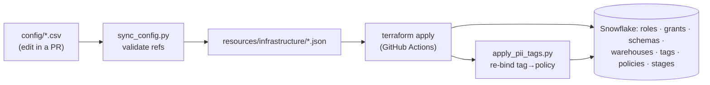
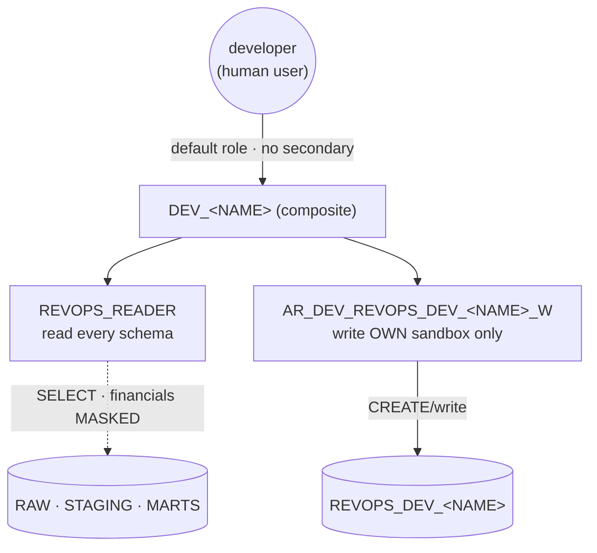
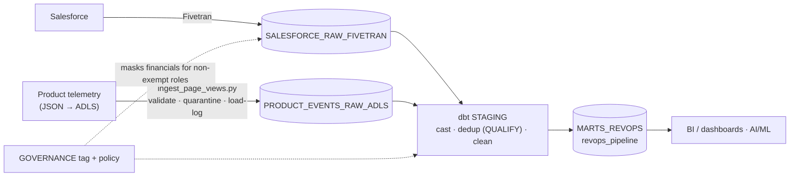
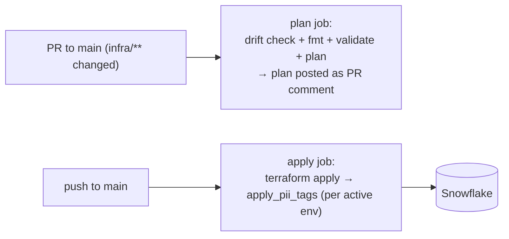

# OpenGov Data Platform — Infrastructure (RevOps domain)

Config-driven, CI/CD-deployed Snowflake platform: RBAC, governance (PII masking),
ingestion contract objects, and native-dbt plumbing — all as code, promoted
through GitHub Actions. Two environments (`OG_DEV_DB`, `OG_PROD_DB`), one account.

> **Paved path:** every operational change (onboard a developer, add a schema,
> grant a role, add a masking rule…) is a **one-row CSV edit in a PR**. See
> [`docs/runbooks/`](docs/runbooks) for the step-by-step for each.

---

## 1. What's here

```
infra/
├── config/                 # the human interface — CSVs (source of truth)
├── sync_config.py          # CSV -> JSON manifests (validates references)
├── resources/infrastructure/*.json   # generated; what Terraform reads
├── terraform/              # HCL: for_each over the manifests (no object lists in HCL)
├── apply_pii_tags.py       # binds tag->masking-policy + classifies PII columns
├── seed/                   # mock Fivetran RAW tables (stand-in for a real connector)
├── bootstrap/              # one-time OG_DEPLOYER creation
└── docs/runbooks/          # operational guides (the paved path)
```

## 2. Config-driven IaC flow

No object lists live in HCL. You edit a CSV; `sync_config.py` turns it into JSON
manifests (cross-validating every reference so mistakes fail at *sync* time, not
`apply` time); Terraform `for_each`es over the JSON.



```bash
python infra/sync_config.py            # regenerate manifests (validates)
python infra/sync_config.py --dry-run  # preview without writing
```

`is_active=false` soft-deletes a row on the next apply. A new domain, schema,
role, warehouse, or developer sandbox is a new row.

## 3. Snowflake layout

```
OG_<ENV>_DB
├── SALESFORCE_RAW_FIVETRAN    RAW — Fivetran-owned DDL (writer_owns_future=true)
├── PRODUCT_EVENTS_RAW_ADLS    RAW — Python/ADLS loader; contract tables are deployer-owned (DML-only writer)
├── STAGING                    dbt staging (built by REVOPS_DEVELOPER)
├── MARTS_REVOPS               dbt RevOps marts (built by REVOPS_DEVELOPER)
├── GOVERNANCE                 PII_FINANCIAL tag + masking policy (no data)
├── DBT                        native "dbt Projects on Snowflake" objects
└── REVOPS_DEV_<NAME>          per-developer sandbox (DEV only)
```

RAW schemas are `<SOURCE>_RAW_<INGESTION_TYPE>` so each loader's rights scope to
exactly its landing schema. The brief's `RAW.SALESFORCE.ACCOUNT` ⇒
`OG_<ENV>_DB.SALESFORCE_RAW_FIVETRAN.ACCOUNT`; `RAW.PRODUCT_EVENTS.PAGE_VIEWS` ⇒
`OG_<ENV>_DB.PRODUCT_EVENTS_RAW_ADLS.PAGE_VIEWS`. (Owner decision: telemetry
lands in **ADLS**, not S3 — the brief's boto3 pattern implemented 1:1 on Azure Blob.)

**Warehouses** are per role for cost attribution, named `OG_<ENV>_<ROLE>_WH`:
`READER` (XS), `ANALYST` (M), `DEVELOPER` (M), `ADMIN` (XS), `INGEST_ADLS` (XS),
`INGEST_FIVETRAN` (XS). See [warehouses runbook](docs/runbooks/warehouses.md).

## 4. RBAC — two tiers

> Functional roles are **account-wide**, not per-env: an identity holds one role
> that applies to `OG_DEV_DB` *and* `OG_PROD_DB`. The environment dimension lives
> only in the **access-role tier** (`AR_<ENV>_<SCHEMA>`), composed per env via
> `functional_grants.csv` `env=ALL` rows. One grant, both databases.

**Tier 1 — access roles** (never granted to users; the only env-scoped layer):
`AR_<ENV>_<SCHEMA>_R` (usage + select, current & future) and `_W` (write + DML;
`writer_owns_future` controls whether the writer also owns future DDL).

**Tier 2 — functional roles** (account-wide; humans/services hold these):

| Role | Reads | Writes | Held by |
|------|-------|--------|---------|
| `REVOPS_READER` | all schemas (incl. GOVERNANCE/DBT) | — | humans (via composite `DEV_<NAME>`) |
| `REVOPS_ANALYST` | `MARTS_*` only | — | analysts |
| `REVOPS_DEVELOPER` | RAW + STAGING + MARTS | STAGING + MARTS (all envs, incl. PROD) | **service only** (dbt CI) — never humans |
| `REVOPS_ADMIN` | everything | everything | SYSADMIN (break-glass) |
| `REVOPS_INGESTION_ADLS` | — | `PRODUCT_EVENTS_RAW_ADLS` (DML only) | ADLS loader svc |
| `REVOPS_INGESTION_FIVETRAN` | — | `SALESFORCE_RAW_FIVETRAN` (owns DDL) | Fivetran svc |

Hierarchy: `REVOPS_ANALYST → REVOPS_READER → REVOPS_DEVELOPER → REVOPS_ADMIN →
SYSADMIN`; ingestion roles hang off `SYSADMIN`. `human_assignable=false` marks
service-only roles; `sync_config.py` **rejects** granting one to a human.

### Developers use a composite role (no secondary roles)

Each developer gets a per-person **composite role** `DEV_<NAME>` =
`REVOPS_READER` (read all) **+** their own sandbox write
(`AR_DEV_REVOPS_DEV_<NAME>_W`), generated from the DEV `developers` list in
`environments.csv`. It's their **default role**, and **secondary roles are
disabled** (`DEFAULT_SECONDARY_ROLES = ()`), so every session reflects exactly
one role — which keeps `IS_ROLE_IN_SESSION` masking checks unambiguous.



Humans never hold `REVOPS_DEVELOPER`; production writes happen only through the
dbt CI service user (`OG_DBT_SVC`). → [onboard-developer runbook](docs/runbooks/onboard-developer.md).

**Service users** (`service_users.csv`, `TYPE=SERVICE`, key-pair JWT only):
`OG_DBT_SVC` (`REVOPS_DEVELOPER`, dbt builds DEV+PROD), `OG_INGEST_ADLS_SVC`
(`REVOPS_INGESTION_ADLS`), `OG_FIVETRAN_SVC` (`REVOPS_INGESTION_FIVETRAN`).

## 5. Governance — tag-based PII masking

`GOVERNANCE.PII_FINANCIAL` tag → `MASK_PII_FINANCIAL_NUMBER` policy. Columns are
classified in `pii_columns.csv` (`ACCOUNT.ARR`, `OPPORTUNITY.AMOUNT`). **Exempt
roles** (`masking_exemptions.csv`) see the real value: `REVOPS_ADMIN`,
`REVOPS_DEVELOPER`, `REVOPS_ANALYST` — **not** `REVOPS_READER`.

Effect: **analysts see financials in the mart**; a plain reader (and any
developer building in their dev sandbox, since `DEV_<NAME>` inherits
`REVOPS_READER` and is not exempt) sees `NULL` in RAW/STAGING. Classifying a
column *is* protecting it — no per-table policy wiring, and it scales to every
future domain through the tag.

Masking is fully config-driven & extensible — three CSVs, zero HCL:
`masking_rules.csv` (what rules exist: `tag × data_type → mask expression`),
`pii_columns.csv` (what is classified), `masking_exemptions.csv` (who is exempt,
by role — never by user, so offboarding is one role revoke). Ships inactive
`PII_CONTACT`/`PII_PHONE` examples. → [masking-rules runbook](docs/runbooks/masking-rules.md).

> ⚠️ **Every `terraform apply` drops the tag→policy binding** (it isn't a TF
> resource in this provider). `apply_pii_tags.py` re-establishes it and must run
> after each apply — the CI does this automatically (§7). It treats
> "object does not exist" as a skip, so un-synced env tables (e.g. a Fivetran
> table not yet in PROD) don't fail the deploy.
> ```bash
> python infra/apply_pii_tags.py --env DEV     # bind tag→policy + classify columns
> python infra/apply_pii_tags.py --env PROD --dry-run
> ```

### ADLS telemetry contract objects

Files land in the `og-telemetry` container of the `snowopssa` storage account,
env-prefixed: `azure://…/og-telemetry/<env>/product_events/page_views/dt=…/hr=…/`.
Terraform deploys the full contract: `OG_ADLS_INT` (storage integration),
`PAGE_VIEWS_STAGE` (keyless external stage per env), `FF_JSON` (file format), and
the `PAGE_VIEWS` / `_QUARANTINE` / `_LOAD_LOG` tables (promoted keys +
`payload VARIANT`, from `tables.csv` + `resources/tables/<key>.json`). The loader
schema is **DML-only** (`writer_owns_future=false`) — it can INSERT/COPY but never
ALTER/DROP the platform-owned contract. One-time: create the container + grant
the Snowflake service principal `Storage Blob Data Contributor` after
`DESC STORAGE INTEGRATION OG_ADLS_INT` consent.

## 6. Full data flow (source → dashboard)



## 7. CI/CD



- **State**: remote `azurerm` backend in `snowopssa` (`og-tfstate` container) —
  CI and local share state.
- **Auth**: `OG_DEPLOYER_SVC` key-pair (Snowflake) + storage key (backend), all
  from GitHub secrets — nothing committed. Malicious-PR safe: secrets are only
  available to the `apply` job on `push: main`, never to PR-triggered `plan`.
- Workflow: [`.github/workflows/infra.yml`](../.github/workflows/infra.yml).

## 8. Deploy manually (if not via CI)

```bash
# one-time: generate deployer key, paste public key into bootstrap_deployer.sql,
# run it as ACCOUNTADMIN. Then:
export TF_VAR_SF_ORGANIZATION_NAME=IVUTLPR TF_VAR_SF_ACCOUNT_NAME=JZ06632 \
       TF_VAR_SF_USERNAME=OG_DEPLOYER_SVC TF_VAR_SF_WAREHOUSE=OG_DEPLOYER_WH \
       TF_VAR_SF_PRIVATE_KEY="$(cat ~/.snowflake/keys/og_deployer_rsa_key.p8)" \
       ARM_ACCESS_KEY=<snowopssa key>
python infra/sync_config.py
cd infra/terraform && terraform init && terraform apply
python infra/apply_pii_tags.py --env DEV && python infra/apply_pii_tags.py --env PROD
```

## 9. Audit — who saw `ACCOUNT.ARR`, and when?

```sql
SELECT ah.query_start_time, ah.user_name, q.role_name,
       f.value:objectName::string AS table_fqn
FROM snowflake.account_usage.access_history ah
JOIN snowflake.account_usage.query_history q USING (query_id),
     LATERAL FLATTEN(ah.base_objects_accessed) f,
     LATERAL FLATTEN(f.value:columns) c
WHERE f.value:objectName::string ILIKE '%SALESFORCE_RAW_FIVETRAN.ACCOUNT'
  AND c.value:columnName::string = 'ARR'
ORDER BY ah.query_start_time DESC;
```

## 10. Runbooks (paved path)

| Task | Guide |
|------|-------|
| Onboard / offboard a developer | [onboard-developer.md](docs/runbooks/onboard-developer.md) |
| Add a schema | [new-schema.md](docs/runbooks/new-schema.md) |
| Change functional grants | [functional-grants.md](docs/runbooks/functional-grants.md) |
| Add / change a human user | [human-users.md](docs/runbooks/human-users.md) |
| Assign a user role | [user-roles.md](docs/runbooks/user-roles.md) |
| Add a masking rule / classify PII | [masking-rules.md](docs/runbooks/masking-rules.md) |
| Add a service user | [service-users.md](docs/runbooks/service-users.md) |
| Add / resize a warehouse | [warehouses.md](docs/runbooks/warehouses.md) |
| Onboard a whole new domain | [new-domain.md](docs/runbooks/new-domain.md) |

The full data flow and dbt project live in the
**[opengov-dbt-hub](https://github.com/akashpahilwan/opengov-dbt-hub)** repo.
